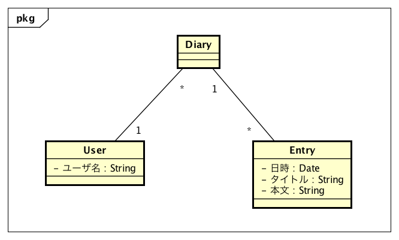

#データモデリング

##登場する概念と特性
- `User` 日記を書くユーザ
    - ユーザの名前を持っている

- `Diary` 各ユーザの日記
    - 投稿されたEntryを持つ
    - 日記の持ち主(User)を持つ

- `Entry` 日記に投稿される記事
    - 投稿された日時
    - タイトル
    - 本文

- ユーザは日記を一つだけ持つ
- 日記は記事を0以上持つ
